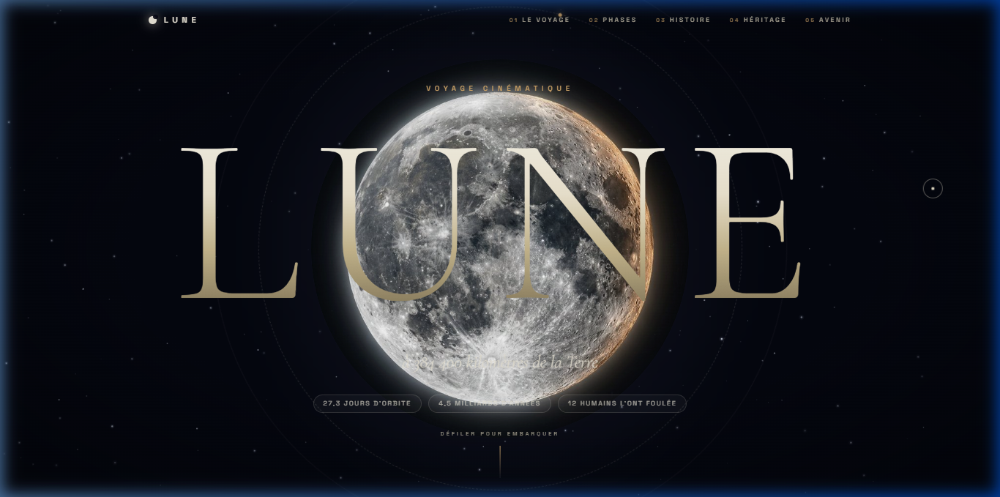
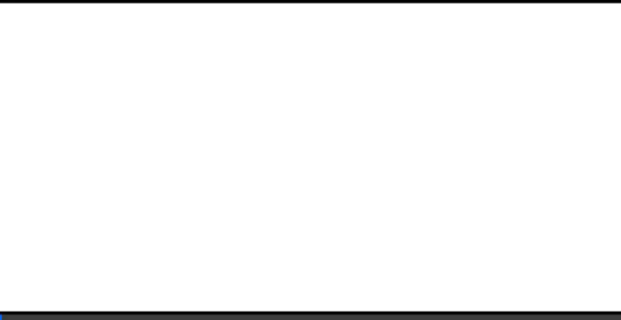
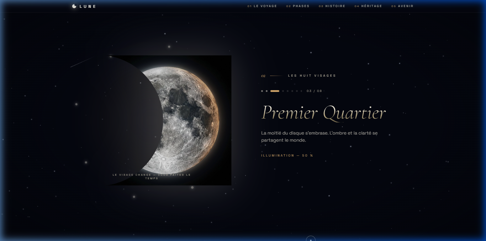
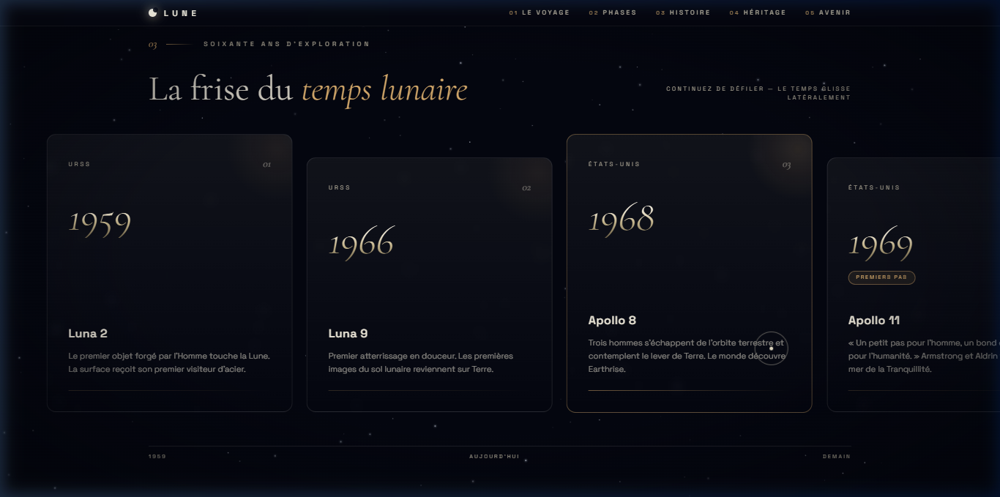

# 🌙 LUNE — Voyage Cinématique

> Un voyage immersif à travers les phases, l'histoire et l'avenir de notre satellite naturel.  
> **384 400 km** de la Terre. Une expérience visuelle conçue pour être ressentie.

<p align="center">
  
  
  
  
  
</p>

---

## ✨ Aperçu

<p align="center">
  
</p>

**LUNE** est un site web cinématique à défilement vertical qui plonge le visiteur dans l'univers de la Lune — de ses phases mystérieuses aux grandes missions spatiales, jusqu'aux projets de retour de l'humanité sur sa surface.

L'expérience est pensée comme un court-métrage interactif : chaque section est une scène, chaque animation est une émotion.

### 🎬 Démonstration en direct

<p align="center">
  
</p>

### 🔭 Galerie des sections

<p align="center">
  
  
</p>

---

## 🎬 Effets visuels & Animations

| Effet | Description |
|-------|-------------|
| **Film grain argentique** | Bruit fractal animé en boucle simulant la texture d'une pellicule 35mm |
| **Vignette optique** | Assombrissement des bordures d'écran pour une immersion totale |
| **Curseur personnalisé** | Curseur lunaire avec halo lumineux qui réagit aux éléments interactifs |
| **Preloader cinématique** | Écran de chargement avec compte à rebours et barre de progression |
| **Parallax multi-couches** | Fond étoilé avec mouvement au scroll créant une profondeur spatiale |
| **Champ d'étoiles procédural** | Génération dynamique de centaines d'étoiles avec scintillement aléatoire |
| **Smooth scroll (Lenis)** | Défilement ultra-fluide façon application native |
| **Marquee de télémétrie** | Bandeau de données spatiales défilant en continu |
| **Compteurs animés** | Chiffres clés qui s'animent au scroll (distance, durée, températures) |
| **Phases lunaires interactives** | Sélecteur des 8 phases avec transitions Framer Motion |
| **Frise chronologique** | Timeline des missions Apollo à Artemis avec entrées au scroll |
| **Halos dorés pulsants** | Respiration lumineuse des éléments d'arrière-plan |
| **Reflets métalliques** | Texte avec dégradé or et nacre animé |
| **Hover 3D cards** | Cartes avec effet de profondeur et lumière directionnelle |
| **Footer avec ascension** | Bouton de retour en haut avec transition d'icône |

---

## 🛠️ Stack technique

- **React 19** — Composants UI
- **TypeScript** — Typage statique
- **Vite 7** — Build tool ultra-rapide
- **Tailwind CSS 4** — Design system utilitaire
- **Framer Motion** — Animations physiques et transitions
- **Lenis** — Smooth scrolling natif
- **vite-plugin-singlefile** — Build en fichier HTML unique auto-suffisant

---

## 🚀 Lancer le projet en local

> ⚠️ Ce projet est une application React. Il ne s'ouvre **pas** en double-cliquant sur `index.html`. Il faut passer par un serveur de développement.

### Prérequis

- [Node.js](https://nodejs.org/) version 18 ou supérieure
- npm (inclus avec Node.js)

### Installation

```bash
# 1. Cloner le dépôt
git clone https://github.com/Shad0wOO7/cinematic-moon-website.git

# 2. Se placer dans le dossier
cd cinematic-moon-website

# 3. Installer les dépendances
npm install

# 4. Lancer le serveur de développement
npm run dev
```

Le site sera disponible sur **http://localhost:5173**

### Build de production

```bash
npm run build
```

Le fichier final `dist/index.html` est un fichier HTML **unique et autonome** — toutes les ressources (CSS, JS, images) y sont intégrées. Il peut être ouvert directement dans un navigateur ou déployé sur n'importe quel hébergeur.

---

## 📁 Structure du projet

```
cinematic-moon-website/
├── src/
│   ├── components/
│   │   ├── Hero.tsx          # Section d'accueil avec parallax
│   │   ├── Phases.tsx        # Les 8 phases lunaires interactives
│   │   ├── Stats.tsx         # Compteurs animés de données lunaires
│   │   ├── Histoire.tsx      # Frise chronologique des missions
│   │   ├── Avenir.tsx        # Projets futurs (Artemis, bases lunaires)
│   │   ├── Voyage.tsx        # Section immersive surface lunaire
│   │   ├── Heritage.tsx      # Héritage culturel de la Lune
│   │   ├── Kit.tsx           # Kit de survie / données techniques
│   │   ├── Preloader.tsx     # Écran de chargement cinématique
│   │   ├── Navbar.tsx        # Navigation fixe avec scroll detection
│   │   ├── Cursor.tsx        # Curseur personnalisé
│   │   ├── StarField.tsx     # Champ d'étoiles procédural
│   │   ├── Marquee.tsx       # Bandeau de télémétrie défilant
│   │   └── Footer.tsx        # Pied de page avec bouton d'ascension
│   ├── App.tsx               # Composition principale
│   ├── main.tsx              # Point d'entrée React
│   └── index.css             # Design system & animations CSS
├── public/
│   └── images/               # Photographies lunaires HD
├── index.html                # Template HTML
├── vite.config.ts            # Configuration Vite
├── package.json              # Dépendances
└── tsconfig.json             # Configuration TypeScript
```

---

## 🌐 Déploiement

Le projet est compatible avec **GitHub Pages**, **Vercel**, **Netlify** et tout hébergeur statique.

---

*Fait de nuit, sous la Lune 🌙*
